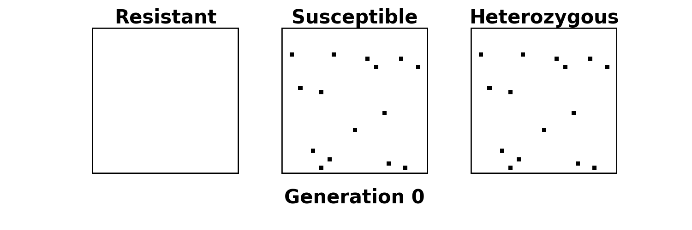
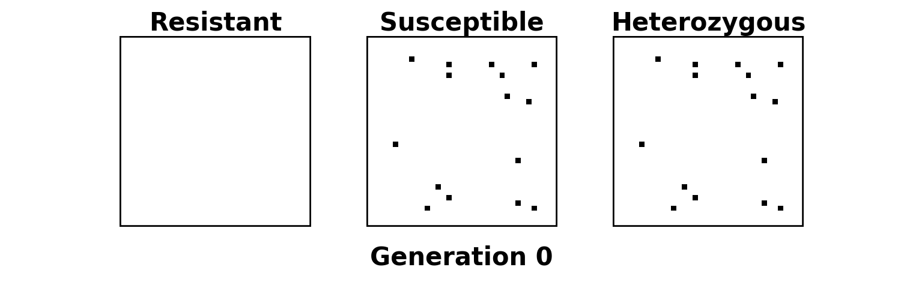

# Pest Transgenics Modelling
 
 ## Spatial distribution of genotypes over time for different refuge configurations. Considering 22% refuge in the around configuration and 23% in the other three configurations.

| Around Refuge | Block Refuge |
|------------------|-------------------|
|  |  |

| Stripe Refuge | Random Refuge |
|-------------------|-------------------|
|  |  |